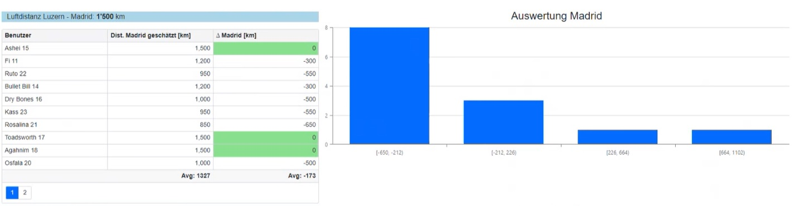
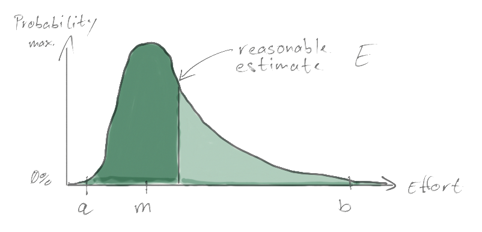
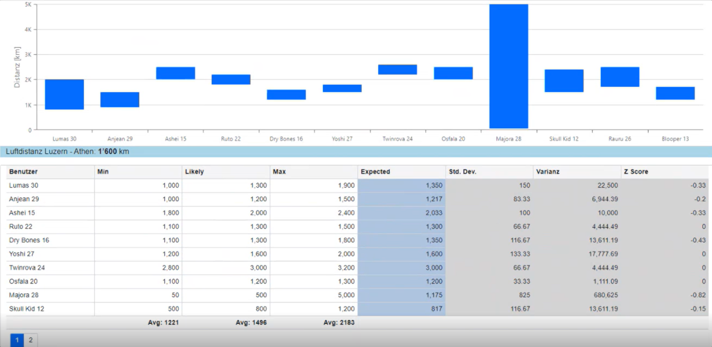
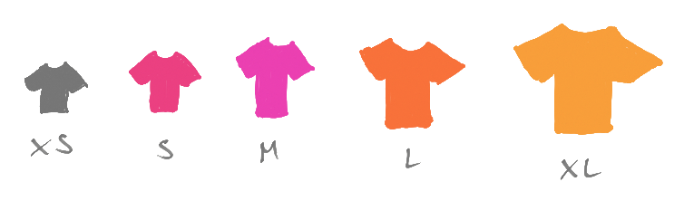
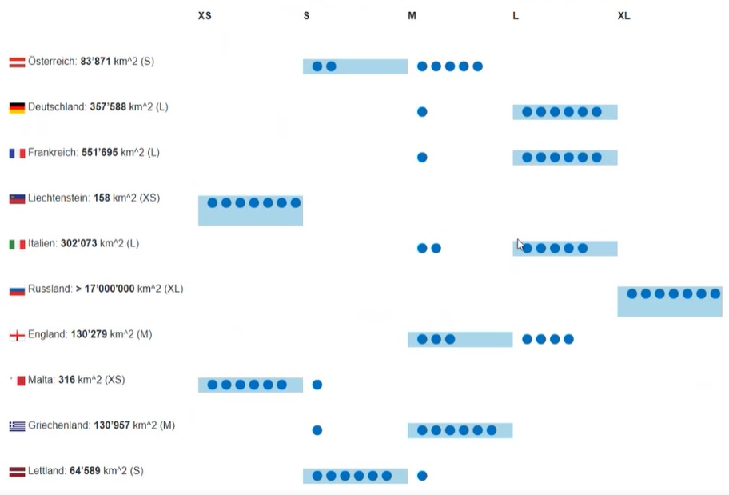

# Estimation Survey

This project contains the source code for a simple web application providing
survey capabilities for estimation demo exercises.

## Technology

The demo project was created using the [DevExpress UI Components for Blazor]
on a [ASP.NET Core 6.0] [Blazor Server App] using [SignalR] [Razor Pages] Web Application


## Exercise 1: Guess the distance - Histogram

In the first exercise, the participants ought to guess the distance between two
cities. Based on the differences to the right answer, a [histogram] will be
calculated and displayed.

The number of columns ($NCol$) in the histogram will be
determined automatically by the number of answers given ($NAns$).

$$ NCol = \sqrt{NAns} $$

The value range of each column ($RCol$) will be determined by the difference of
the lowest value ($min$) to the greates value ($max$) proportional to the number
of columns ($NCol$).

$$ RCol = { max - min \over NCol} $$

This is how the razor code looks like for creating the histogram based on the
DevExpress [DxChart - Histogram] control:

```cpp
@code
{
    private uebung1MadridDistribution = 
        DistributionCalculator.GenerateNormalDistributionForUebung1Madrid();
}
```

```xml
<DxChart Data="@uebung1MadridDistribution"
         T="DistributionItem">
    <DxChartTitle Text="Auswertung Madrid" />
    <DxChartBarSeries ArgumentField="@((DistributionItem i) => i.Gruppe)"
                      ValueField="@((DistributionItem i) => i.AnzahlSchaetzungen)">
    </DxChartBarSeries>
    <DxChartLegend Visible="false" />
</DxChart>
```

And this is how the resulting view is rendered:



## Excerise 2: PERT - Range

In the second exercise, the participants ought to estimate the distance between
two cities by giving a range guess using the [Three-point estimation] of the
Program evaluation and review technique (PERT), where the Estimate $E$ is
calculated using the values:

* $a$ = the best-case estimate
* $m$ = the most likely estimate
* $b$ = the worst-case estimate

$$ E = {a + 4*m + b \over 6} $$



This is how the razor code looks like for creating the range based on the
DevExpress [DxChart - Range Bar] control:

```cpp
@code
{
    private IEnumerable<Uebung2OnePertEstimateByUser> uebung2AthenEstimates =
        ResponseStore
            .GetAllUebung2()
            .Select(x => new Uebung2OnePertEstimateByUser(x.UserId, x.ToAthen));
}
```

```xml
<DxChart Data="@uebung2AthenEstimates"
         T="Uebung2OnePertEstimateByUser"
         CustomizeElement="Grid_CustomizeElement">
    <DxChartRangeBarSeries StartValueField="@((Uebung2OnePertEstimateByUser p) => p.Estimate.BestCase)"
                           EndValueField="@((Uebung2OnePertEstimateByUser p) => p.Estimate.WorstCase)"
                           ArgumentField="@((Uebung2OnePertEstimateByUser p) => p.UserId)" />
    <DxChartTooltip Enabled="true">
        @context.GetRangePoint().Render((rangePoint) =>
        @<div style="margin: 0.75rem">
            <div>@rangePoint.StartValue - @rangePoint.EndValue</div>
        </div>)
    </DxChartTooltip>
    <DxChartValueAxis>
        <DxChartAxisTitle Text="Distanz [km]" />
    </DxChartValueAxis>
    <DxChartArgumentAxis>
        <DxChartAxisLabel />
    </DxChartArgumentAxis>
    <DxChartLegend Visible="false" />
</DxChart>
```

And this is how the resulting view is rendered:



## Excerise 3: T-Shirt size - Vote Distribution

In the third exercise the participants ought to estimate the size of different
countries using the T-Shirt size approach, where the size **XS** represents
the smallest countries and the size **XL** represents the biggest countries.



To render the result the html code will be composed by a custom code block in
the front end code of the view. For the layout the [DevExpress - Grid Layout] control
is used.

```cpp
    private IEnumerable<Uebung3EstimatesByUser> allOtherResponses =
        ResponseStore
            .GetAllUebung3()
            .Where(x => x.UserId != this.myUserName);

    private Uebung1Estimates myEstimate = ResponseStore.GetEstimateUebung3(myUserName);
```

```xml
<DxGridLayoutItem Row="1" Column="0">
    <Template>
         Österreich: <b>83’871</b> km^2 (S)
    </Template>
</DxGridLayoutItem>
<DxGridLayoutItem Row="1" Column="1">
    <Template>
    <div class="row w-100 mx-0">
    <p class="col-12 mt-2">
        @{
            if (myEstimate.Oesterreich == TShirtSize.XS)
            {
                <span>@OwnVote</span>
            }
            for (int i = 0; i < allOtherResponses.Count(x => x.Oesterreich == TShirtSize.XS); i++)
            {
                <span>@Vote</span>
            }
        }
    </p>
    </div>
    </Template>
</DxGridLayoutItem>
```

And this is how the view looks like.



## Credits

### Image Sources

* Map of Europe taken from https://www.freeworldmaps.net

### DevExpress Controls

* DevExpress UI Components for Blazor: https://demos.devexpress.com/blazor
* Histogram: https://demos.devexpress.com/blazor/ChartHistogram
* Range Bar: https://demos.devexpress.com/blazor/ChartRangeBar
* Grid Layout: https://demos.devexpress.com/blazor/GridLayout

[ASP.NET Core 6.0]: https://learn.microsoft.com/en-us/aspnet/core/release-notes/aspnetcore-6.0
[Blazor Server App]: https://learn.microsoft.com/en-us/aspnet/core/blazor/hosting-models#blazor-server
[DevExpress UI Components for Blazor]: https://demos.devexpress.com/blazor/
[DxChart - Histogram]: https://demos.devexpress.com/blazor/ChartHistogram
[DxChart - Range Bar]: https://demos.devexpress.com/blazor/ChartRangeBar
[DevExpress - Grid Layout]: https://demos.devexpress.com/blazor/GridLayout
[histogram]: https://en.wikipedia.org/wiki/Histogram
[Razor Pages]: https://learn.microsoft.com/en-us/aspnet/core/razor-pages
[SignalR]: https://learn.microsoft.com/en-us/aspnet/core/signalr/introduction
[Three-point estimation]: https://en.wikipedia.org/wiki/Three-point_estimation
